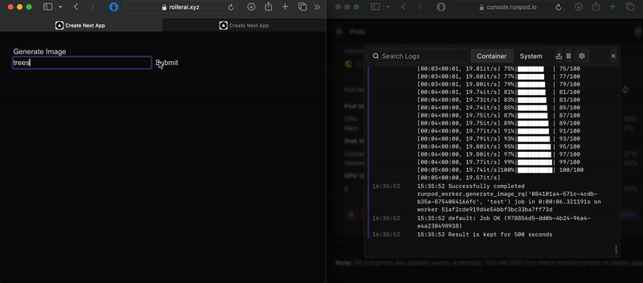

# RollerAI

This goal of this project was to create a website which allows users to create AI-generated images based on a text prompt. The cloud-based architecture was designed to be low-cost and scalable through a combination of virtual machines (as opposed to microservices) and job queue with a set of autoscaling worker pods.

## System Overview

Below is the system diagram for this project.

```
+---------------------------------------+
|              Frontend VM              |
|                                  (EC2)|
+---------------------------------------+
     ^                        |   ^
     |                        v   |
     |    +------------------------------+
     |    | Redis + Python script   (EC2)|
     |    +------------------------------+
     |                        |  ^
     |                        v  |
     |              +---------------------+
     |              |       RunPod        |
     v              |  +---------------+  |
+------------+      |  |     Pod 1     |  |
|     S3     |<-----|  +---------------+  |
+------------+      |  |     Pod 2     |  |
                    |  +---------------+  |
                    +---------------------+
```

For the frontend NextJS is used, with FastAPI for the backend in conjunction with AWS API Gateway. The generated images are passed from RunPod (a cloud GPU platform) to S3, with the frontend polling S3 until the image is generated

The jobs are are queued in a Redis message queue acting as a job queue. The jobs themselves are a Redis hash, with a random Job ID assigned as the key and multiple values assigned to each key (status of job, text prompt, image storage URL). This allows multiple requests to be handled simultaneously with a FIFO approach. Images are generated using the Stable Diffusion 1.5 model.

Two processing pods are used to take advantage of on-demand pricing: Pod 1 is always on, with Pod 2 activating via the Autoscaler when high demand is detected.

## Autoscaler

In order to handle increases in requests, a custom autoscaler runs as a background service on the backend VM. Below shows a system diagram of how all the pieces interact: The autoscaler constantly monitors the length of the Redis queue and uses a hysterisis approach (preventing excessive activation and deactivation of the second pod) and the Runpod API to turn on and off the second pod. 

```                       
                          +======+
        ----------------->|  S3  |<-----------------
        |                 +======+                 | 
        |                                          |
+================+                        +================+   
|     POD 1      |   +================+   |     POD 2      |
|----------------|<--|   Autoscaler   |-->|----------------|
|    worker.py   |   +================+   |    worker.py   |   
+================+           ^            +================+
          ^                  |                  ^
          |                  |                  |
          v                  v                  v
+--------------------------------------------------------+
|                     Redis Queue                        |
+--------------------------------------------------------+
                            ^
                            |
                    +---------------+
                    |    Backend    |
                    +---------------+
```

This approach highlighted the importance of technologies such as Kubernetes KEDA, which would more efficiently handle workload balancing and scaling for a larger amount of pods, including the ability to retry failed tasks.

## Conclusion 

Due to the VM/pod architecture, running costs means the website is not always up, however a demo can be seen below with the queue system being demonstrated.



Although the project has achieved its aims, there is still room to introduce more features and technologies to increase flexiblity and usefulness:
- Allow the user to choose from multiple AI image generation models
- Implement real payment options through a Stripe API, credits system, and user/authorisation system
- Create a subpage for users to access their previously images generated

